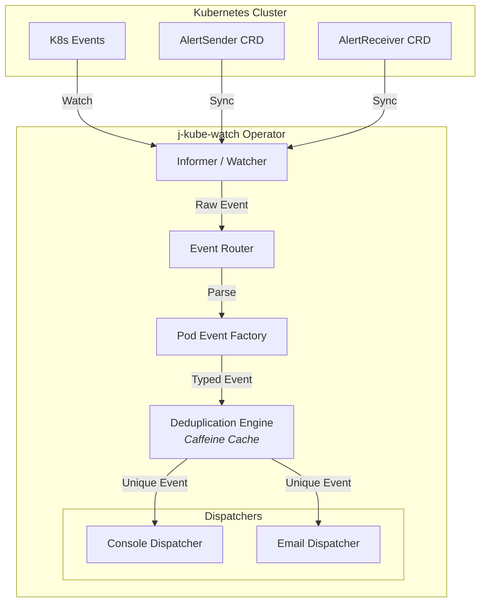
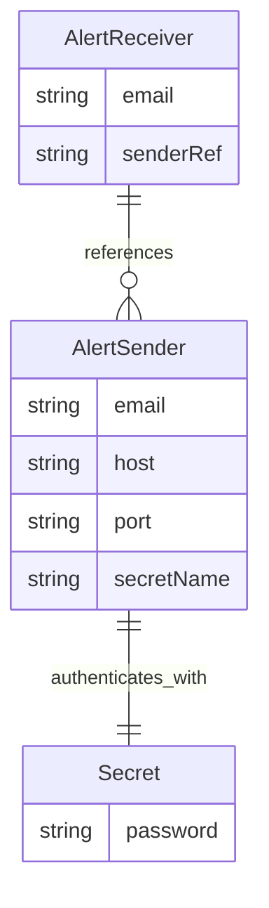

# j-kube-watch

**j-kube-watch** is a lightweight, high-performance Kubernetes Operator built in Java 21 using the Fabric8 Kubernetes Client. It actively monitors your cluster for Pod-related events, intelligently deduplicates repetitive warnings, and dispatches categorized alerts to configured destinations (like Console and Email) using Custom Resource Definitions (CRDs).

---

## Features

- **Smart Event Routing:** Automatically categorizes raw Kubernetes events into domain-specific types (Scheduling, Image Lifecycle, Volume Mounts, Evictions, etc.).
- **Intelligent Deduplication:** Uses Caffeine cache to suppress alert storms. If a pod crash-loops or fails a probe repeatedly, you get one initial alert followed by a summary of suppressed duplicates after a cool-down period.
- **CRD-Driven Configuration:** Manage your notification pipelines natively through Kubernetes using `AlertSender` and `AlertReceiver` custom resources.
- **High Performance:** Leverages Java 21 Virtual Threads for lightweight, concurrent event processing and dispatching.
- **Rich HTML Emails:** Dispatches beautifully formatted HTML email summaries for critical warnings.
- **Helm Support:** Easily deploy and manage the operator and its RBAC configurations via Helm.

---

## Architecture

The operator acts as a bridge between Kubernetes cluster events and your notification channels.

### Core Pipeline



### CRD Relationship



---

## Supported Event Types

The `PodEventFactory` parses and translates the following Kubernetes conditions:

- **Scheduling Events:** Pod scheduled, or failed scheduling (e.g., missing node).
- **Image Events:** Image pulling, successfully pulled, or `ImagePullBackOff`.
- **Lifecycle Events:** Container created, started, stopped, or `CrashLoopBackOff`.
- **Probe Failures:** Liveness, Readiness, and Startup probe failures.
- **Volume Events:** Successful attachments or failed mounts (e.g., missing ConfigMap).
- **Eviction Events:** Pod evictions due to node pressure (e.g., Ephemeral Storage limits).

---

## Prerequisites

- **Java 21+** (Requires Virtual Threads support)
- **Maven 3.8+**
- **Helm 3.x**
- **Kubernetes Cluster** (Minikube, Kind, or managed cloud K8s)
- `kubectl` configured to interact with your cluster

---

## Installation via Helm

The recommended way to install `j-kube-watch` is using the provided Helm chart, which will automatically set up the deployment, RBAC rules, service accounts, and network policies.

### 1. Install the Helm Chart

Run the following command from the root directory to install the chart into a dedicated namespace:

```bash
helm install j-kube-watch ./helm \
  --namespace j-kube-watch-operator \
  --create-namespace
```

_Note: Helm 3 will automatically install the Custom Resource Definitions located in the `crds/` directory during this step._

### 2. Configure Email Alerts

First, create a Kubernetes Secret containing your SMTP password:

```yaml
# examples/test-secret.yaml
apiVersion: v1
kind: Secret
metadata:
  name: my-smtp-secret
  namespace: j-kube-watch-operator
type: Opaque
stringData:
  password: "your-app-password"
```

Next, define an `AlertSender` (the SMTP account sending the emails) and an `AlertReceiver` (the destination email):

```yaml
# examples/test-sender.yaml
apiVersion: j-kube-watch.app/v1
kind: AlertSender
metadata:
  name: main-sender
  namespace: j-kube-watch-operator
spec:
  email: "your-sender@gmail.com"
  host: "smtp.gmail.com"
  port: "587"
  secretName: "my-smtp-secret"
---
# examples/test-receiver.yaml
apiVersion: j-kube-watch.app/v1
kind: AlertReceiver
metadata:
  name: manager-receiver
  namespace: j-kube-watch-operator
spec:
  email: "admin-target@company.com"
  senderRef: "main-sender" # Links to the AlertSender above
```

Apply your configuration examples to the cluster:

```bash
kubectl apply -f examples/test-secret.yaml
kubectl apply -f examples/test-sender.yaml
kubectl apply -f examples/test-receiver.yaml
```

---

## Testing the Operator

The repository includes a suite of intentionally failing pods to test the event routing and deduplication engine.

Apply the test events:

```bash
kubectl apply -f examples/test-events.yaml
```

**What to expect:**
You will immediately see structured console output in the operator's pod logs categorizing the failures (e.g., `PROBE FAILURE`, `VOLUME`, `EVICTION`). If email dispatching is configured and valid, HTML alerts will be sent to your `AlertReceiver` emails. The deduplication engine will group repeating errors (like `CrashLoopBackOff`) and log a summary every 2 minutes.

To view the operator logs:

```bash
kubectl logs -l app=j-kube-watch-operator -n j-kube-watch-operator -f
```
